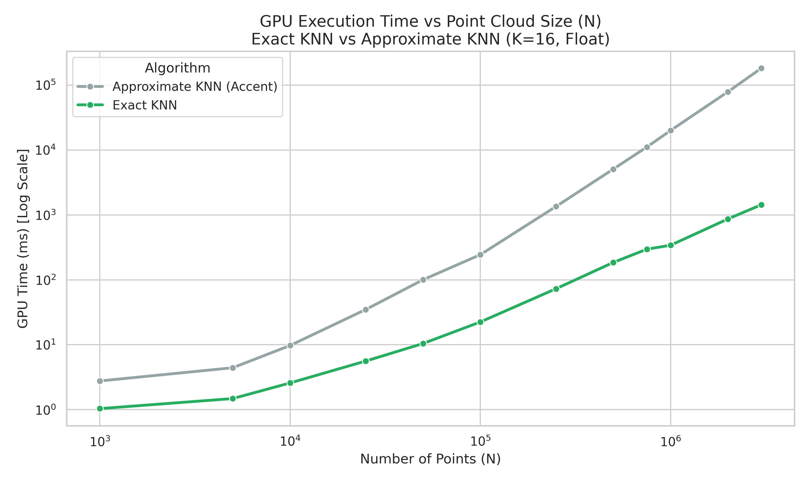
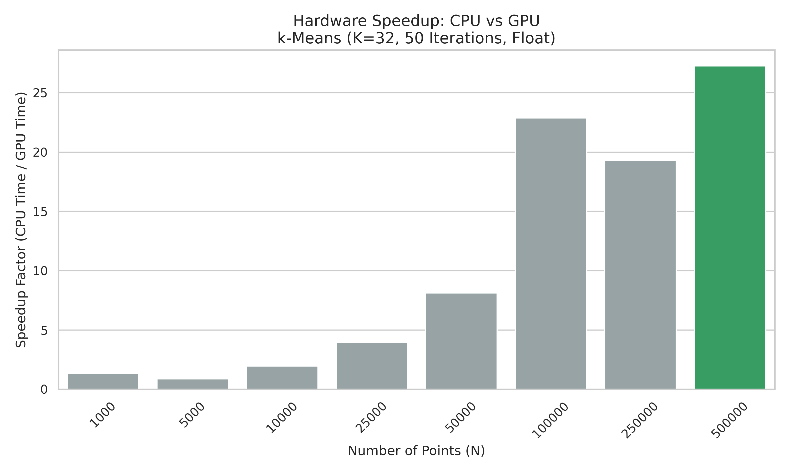

# Equalizing Graphs CUDA

A high-performance CUDA implementation for point cloud intensity equalization. This project explores three primary algorithms to normalize and equalize the intensity of large-scale 3D point cloud data, utilizing GPU acceleration for significant speedups.

## Key Resources

- **[Technical Documentation](Documentation.md)**: Detailed technical explanation of every function, member function, and CUDA kernel.
- **[Project Report (PDF)](docs/Report.pdf)**: Comprehensive analysis of the algorithms, performance results, and architectural decisions.
- **[Interactive 3D Visualization](plots/visualization.html)**: A side-by-side comparison plotly plot of the different equalization methods (Open in a browser).

## Algorithms Implemented

### 1. Exact K-Nearest Neighbors (KNN)
Uses a brute-force approach on the GPU ($O(n \cdot k)$) and an optimized `nth_element` approach on the CPU ($O(n)$ average per point).

### 2. Approximate K-Nearest Neighbors
Utilizes a **Voxel Grid Heuristic** with spatial hashing to significantly reduce the search space, achieving massive speedups over exact KNN with minimal precision loss.

### 3. k-Means Clustering
Segments the point cloud into spatial clusters and applies intensity equalization based on cluster-specific Cumulative Distribution Functions (CDFs). Optimized with **Shared Memory** and **Atomic Operations** on the GPU.

## Performance & Visualizations

### KNN Scaling with N

### KMeans CPU vs GPU Speedup
